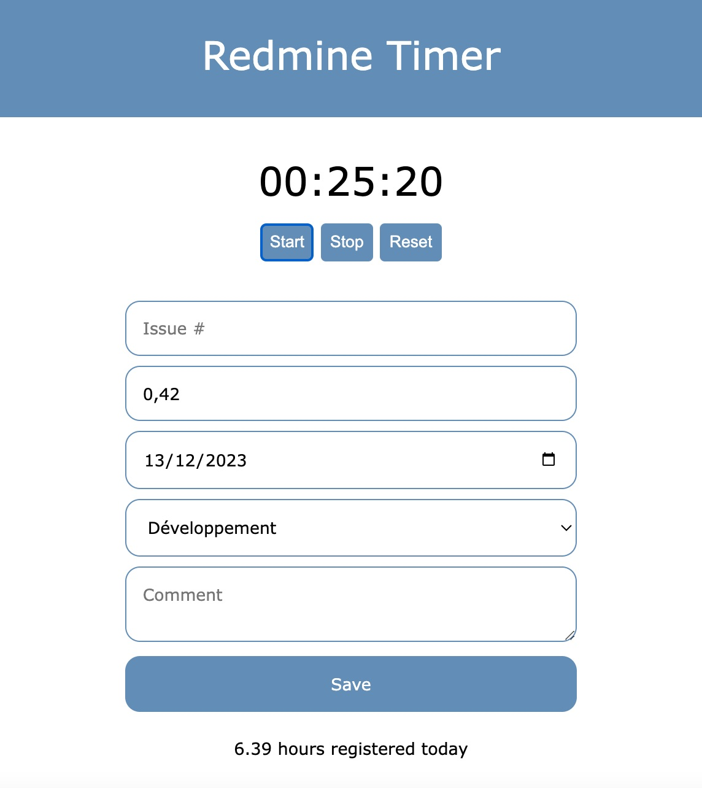

# Redmine Timer

Very (very!) basic web app used to register time entries with Redmine.

It is not (yet?) very sophisticated, but still interesting for day-to-day use. Feel free to fork it and improve to your needs :-)



## Install

1. Clone the project
2. Run composer install
3. Duplicate the `config.sample.php` file to `config.php` and fill the configuration to your needs.
4. Build and run the Docker container:

```shell
docker compose build
docker compose up -d
```

Enjoy the timer at: http://localhost:8000
